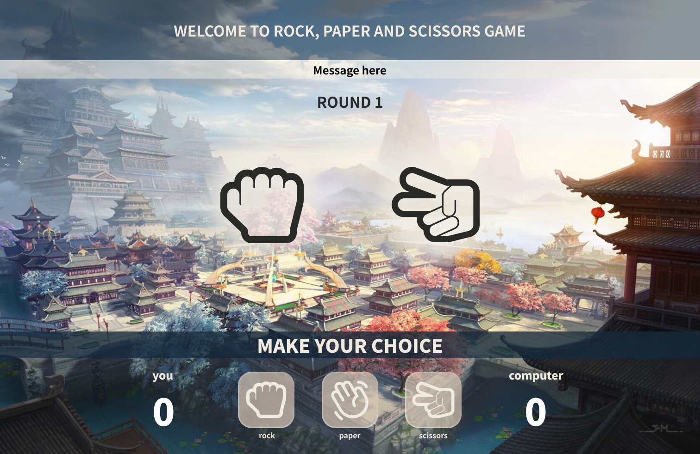

# Rock, paper & scissors
:fist: :raised_hand: :v: <i style="color=C1C4C4"> web page version </i>

#### **Check this project in action:**
link: <a href='https://lincoln-araujo.github.io/Rock-Paper-Scissors-WebGame/' target='_blank'> Rock, paper and scissors - web page </a> 

:memo:**Why did I do this project?** 

    This is the final assignment that I did in the programming training course offered by <a href="https://www.brainnest.consulting/" target="_blank"> BRAINNEST </a>. 
    How this game have a rule that the player must win 5 rounds to be the champion, making a loop was a little challenge because 'while' is a kind of loop really annoying if you do not know how to make it stops. In the end, I could find a way to use 'while' with some 'ifs' to prevent input errors.

